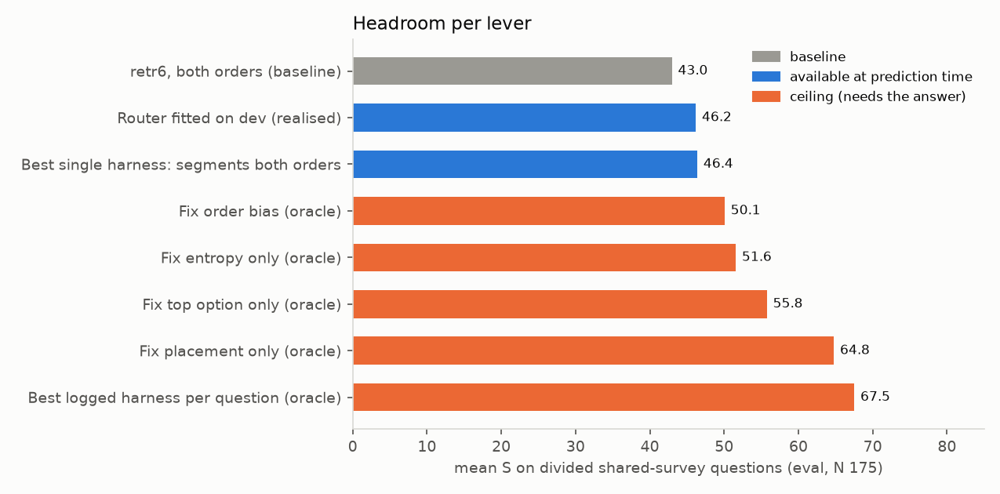
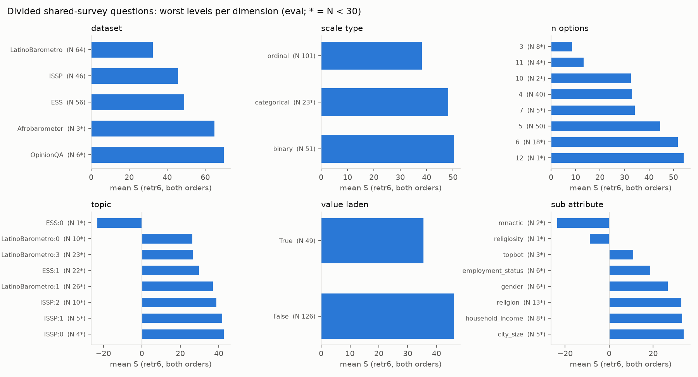
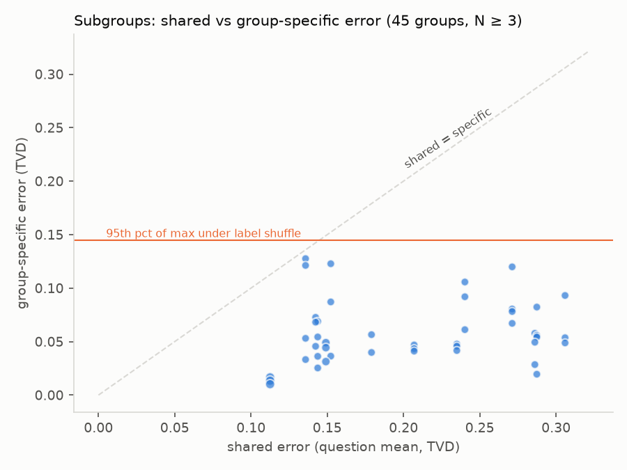

# SimBench distribution injection: all results

Single consolidated file. Part 1 is the progress log (every round, current picks, takeaways, next steps). Appendices A–C hold the full tables for the three latest experiments, which Part 1 only summarises. The same content also lives in the separate files in this folder.

Contents: Part 1 (§1–10) · Appendix A: failure mode, Pop vs Grouped · Appendix B: divided questions, within vs across demographics · Appendix C: divided questions, exploratory analysis of levers

---

# SimBench: injecting human answer distributions — progress log

Status as of 2026-10-02 (updated with §4.13). Branch `claude/blissful-pascal-0ldgye`. All numbers are SimBench scores (higher is better) unless stated.

## 1. The problem

UserSim panels agreed too much, and Pop-split questions scored badly. Adding real answers from other users helped. The question for this work: what is the right way to give the model human answer distributions, both for questions where people agree and for questions where they disagree?

## 2. Setup (fixed for every run)

| Item | Value |
|---|---|
| Score | Official SimBench: `S = 100 × (1 − TVD(pred, human) / mean TVD(human, uniform))`, denominator per dataset |
| Eval sample ("full benchmark") | 981 questions: 25 per Pop dataset, 100 per Grouped dataset, seed 7. Pop 481 / Grouped 500 |
| Dev (tuning) set | 380 questions, disjoint from eval, same per-dataset ratio (10 / 40). Mean entropy 0.72 vs 0.70 eval. Missing 2 small Pop datasets (MoralMachineClassic, OSPsychRWAS: no spare rows, ~3% of eval) |
| Demo pool | Rows outside eval and dev reserve. A demo is never the same question text as the target (also enforced for rewritten questions, see §9) |
| Question types | By normalized entropy of the real answers: **consensus** < 0.65 (top option ~77%), **mixed** 0.65–0.84 (~52%), **divided** ≥ 0.84 (~43%). About one third each, in eval and in the whole benchmark (34 / 33 / 33%). Pop leans divided (37%), Grouped leans consensus (38%) |
| Models | Vertex: Haiku 4.5, Sonnet 4.6, Sonnet 5.5 (global endpoint, no `temperature`, thinking `between_tools`), Gemini 2.5 Flash / Flash-Lite |
| Protocol | Tune on dev, then apply unchanged to eval. Paired bootstrap 95% CIs on per-question differences |

## 3. Glossary of harnesses

| Name | What it does | Calls / question |
|---|---|---|
| `base` | Persona prompt + official instruction | 1 |
| `fewshot` | 3 fixed real distributions from the same dataset | 1 |
| `fs_k6`, `fs_k12` | 6 / 12 fixed demos | 1 |
| **`retr6`** | 6 real distributions for the most similar questions (TF-IDF), same group first, max 2 per question text | 1 |
| `retr6_vs3` | `retr6` demos; model gives 3 candidate distributions with confidences, mixed | 1 |
| `retr6_rev2` | `retr6` asked in original and reversed option order, averaged | 2 |
| `B_n3_soft` | "Split your group into 3 segments; give share + distribution for each", share-weighted. No data | 1 |
| `B_n3_soft_rev2` | Same, both option orders | 2 |
| `B_ground3(_rev2)` | Segments with the 6 retrieved distributions shown first | 1 (2) |
| `B_agents` | 5 archetypes per group (cached), one call each, equal weights | 5 |
| **`P_groundall5`** ("panel") | Planner writes 5 question-specific types + shares, sees 6 real distributions; each type answers in its own call, also sees them; share-weighted | 6 |
| `P_groundall5_R` | The panel run on reversed options, mapped back | 6 |
| `P_adapt` | Panel where the planner estimates agreement first and uses 1–5 types | 2–6 |

## 4. Timeline and results

### 4.1 Starting point (already in the repo, Gemini 2.5 Flash, full benchmark)
| Arm | S | Pop | Grouped |
|---|---|---|---|
| base | 28.6 | 18.0 | 38.8 |
| plural ("report the spread") | 35.7 | 26.6 | 44.5 |
| **fewshot (3 real distributions)** | **41.6** | 35.7 | 47.2 |
| ensemble (5 samples, T=1) | 30.7 | 22.3 | 38.8 |
| no / swapped persona | 10.6 / 13.7 | | |

Isotonic calibration lifted weak arms (+6 to +11) but did almost nothing for fewshot (+0.5).

**Key diagnosis:** predictions are miscalibrated in opposite directions. Too flat on consensus questions, too peaked on divided ones. One global sharpen/flatten cannot fix both: flattening gains +9 on divided and loses 17 on consensus.

### 4.2 Better demos (Flash-Lite full; Haiku 300-question slice)
| Arm | Flash-Lite (981) | Haiku (300) |
|---|---|---|
| base | 16.2 | 36.3 |
| fewshot | 27.1 | 40.3 |
| fs_k6 | 29.6 | 42.9 |
| **retr6** | **32.5** | 45.7 |
| retr6 + entropy labels | 32.4 | 46.0 |

Picking demos by similarity is the main lever. Labelling demos with their spread adds nothing.

### 4.3 Three different mechanisms (Haiku, full)
| Arm | S | Divided |
|---|---|---|
| base | 33.2 | 22.8 |
| retr6 | 43.6 | 33.7 |
| A: shape statistics instead of examples | 33.1 – 34.3 | ~27 |
| B: segment decomposition (`B_n3_soft`) | 31.5 | **37.7** |
| C: calibration keyed on neighbour entropy | no change (43.5 → 43.6) | |

Examples beat summaries of examples. Segments help divided questions and badly hurt consensus ones (28 vs 52).

### 4.4 Retrieval tuning and more segment designs (Haiku dev)
- Retrieval variants vs `retr6` (39.2): reversed demo order 38.7, embeddings 37.7, shape-conditioned 35.7. None helps; TF-IDF is fine.
- Segment designs vs `B_n3_soft` (29.9): adaptive count 28.6, persona agents 29.4, fixed archetype dictionary 24.8 (worse), response-style segments 22.0 (worse).
- Full benchmark: `B_adaptive` 32.5, `B_agents` 31.8, `B_n3_soft` 31.3, `retr6` 43.4. All segment designs sit on the same trade-off curve.
- Share-weighted hybrids (segments invented per question, one call each, weighted by shares): 24.3 – 27.0 on dev, worse than equal weights.

### 4.5 Why segment mixtures fail (logged every segment, dev)
1. **The model's shares carry no information.** Distance to the best possible weights: model shares 0.47, equal weights 0.48.
2. **The prompt forces disagreement.** On consensus questions the mix puts 54% on the top answer vs 78% for real people. The largest segment alone scores better than the mix.
3. **All segments share the model's bias on contested questions.** Mix gets the real top answer only 33–35% of the time (example: 60% of young Guatemalans would accept a military government; every design leaned "no").
4. Archetypes describe survey-taking styles ("Careful Optimizer"), not views, so their answers are near-identical. This reproduces the "panel agrees too much" problem.
5. Headroom from better weights is real only on consensus/mixed questions (after a null control: +31 / +14 / +10 for `B_n3_soft`).

### 4.6 Observable persona panel (Haiku)
| Arm (dev) | S | Consensus | Mixed | Divided |
|---|---|---|---|---|
| Panel, no data | 24.8 | 40.5 | 16.6 | 19.7 |
| Panel, planner sees data | 31.4 | 43.8 | 24.3 | 27.8 |
| **Panel, planner + types see data (`P_groundall5`)** | **39.4** | 46.8 | 37.4 | 34.9 |

Full benchmark: panel **41.6** (consensus 41.8, mixed 43.0, **divided 40.1**). It beats `retr6` on divided (+6.3, CI +3.2 to +9.5) and trails it overall (−1.8). Trace viewer: https://claude.ai/artifact/JXA52y9pfsisQrgpKcrC74 (dev examples).

Consensus gap: the largest type is usually right (74% on the real top answer), but minority types get about half the weight. Fixes on the full benchmark:

| Fix | All | Consensus | Divided |
|---|---|---|---|
| `P_adapt` (planner estimates agreement, 1–5 types) | 40.2 | 47.1 | 34.2 |
| Route between panels by neighbour agreement | 41.9 | 44.1 | 39.7 |
| **Blend: panel + `retr6` as one visible component** | **44.7** | 48.4 | 39.9 |

### 4.7 Divided questions: where we stood after the panel
On divided questions (full, 328 questions): panel 40.1; panel + 30% `B_n3_soft` **44.3** (+4.2 over panel, significant). The panel wins on opinion surveys, segments win on choice/game tasks (NumberGame 59 vs 11, Choices13k 46 vs 25).

**Routing is the bottleneck.** The neighbour-agreement router sends 90% of truly divided questions to the divided harness, but it sends 61% of all questions there. The routed system lands at 43.2, level with `retr6` alone. A perfect router would give about 47. The router signal correlates only 0.58 with true entropy.

### 4.8 Option reversal, multi-candidate, cross-model (then dropped)
- **Leak caught:** the first reversed-options run scored 66.5 because the reworded question no longer matched its own text, so the original question (with its answer) came back as a demo. Fixed (`_orig_template`), verified 0 leaks, re-run: 40.8.
- Full benchmark: `retr6_rev2` 43.6 (no overall gain, divided 33.8 → 35.4); Gemini Flash `retr6` alone **46.3** (consensus 57.5).
- Cross-model mixes reached 48.7 overall, but **we decided to keep models separate** to avoid complexity. Not pursued further.

### 4.9 Same harnesses on each model (dev, no mixing)
| Harness | Haiku | Sonnet 4.6 | Sonnet 5.5 | Gemini Flash |
|---|---|---|---|---|
| **Divided**: persona only | 15.3 | 29.5 | 30.4 | 12.8 |
| **Divided**: `retr6` | 27.2 | 40.6 | 39.0 | 27.7 |
| **Divided**: panel 0.4 + `B_n3_soft_rev2` 0.6 | **43.8** | **43.7** | – | **40.7** |
| **Consensus**: `retr6` | 56.6 | 61.6 | 66.2 | 60.1 |
| **Consensus**: `retr6_vs3` | 54.0 | 59.4 | **67.7** | **60.8** |
| **Overall**: `retr6` | 39.5 | 48.5 | **50.2** | 40.7 |

- Bigger models help consensus questions a lot and divided questions little: the divided harness scores the same on Haiku and Sonnet 4.6.
- **Sonnet 5.5** is available on Vertex, beats Sonnet 4.6 (+4.6 consensus, +1.7 overall) at about two thirds of the price.
- Opus 5.5 estimate for both harnesses on the full benchmark: ~$43, up to ~$95 (thinking can't be turned off). Not run; Sonnet 5.5 chosen instead.

### 4.10 Latest divided-question round (Haiku dev, 126 divided questions)
| Harness | Divided | Overall |
|---|---|---|
| Panel (before) | 34.9 | 39.4 |
| **Panel asked in both option orders, averaged** | **41.0** (+6.1, significant) | **41.1** |
| Segments in both orders | 37.2 | 31.1 |
| Grounded segments, both orders | 38.6 | 37.4 |
| Segments sampled 3× at T=1 | 36.0 | 31.2 |

Cross-validated mixes on divided questions:
| Mix | Divided |
|---|---|
| Panel 0.4 + reversed segments 0.6 (previous best) | 43.7 |
| Panel both orders 0.6 + reversed segments 0.4 | 44.4 |
| **Panel both orders 0.75 + grounded segments 0.25, pulled 29% toward even split** | **45.9** |

### 4.11 Failure mode: Pop vs Grouped, or consensus vs divided? (Haiku)
Full write-up: `simbench_failure_mode_results.md`. Spec: `simbench_failure_mode_spec.md`.

**Step 0 — existing full-benchmark runs split by Pop/Grouped and question type:**
| Arm | Divided: Pop − Grouped | Same, only the 5 datasets in both splits |
|---|---|---|
| base | −23.4 [−33.4, −13.5] | +1.4 [−12.5, +14.7] |
| retr6 | −11.1 [−20.5, −1.5] | −0.3 [−11.4, +10.7] |
| panel | −9.6 [−17.8, −0.8] | −1.8 [−12.4, +9.6] |

On consensus and mixed questions the gap is noise once real data is in the prompt. On divided questions the gap comes from Pop-only task datasets: `retr6` scores OSPsychMACH −1.1, Choices13k −1.9, NumberGame 1.5, OSPsychMGKT −7.2. Inside the same surveys, Pop and Grouped score the same.

**Step 1 — composition data:** derivable only for country-level questions in the 5 shared surveys (Grouped subgroup respondent counts). That is 145 / 981 eval (15%) and 66 dev. Pop-only datasets have none.

**Composition arms (eval, 145 questions; both option orders, `retr6` demos):**
| Arm | All | Pop divided (38) |
|---|---|---|
| C0 `retr6_rev2` | 46.8 | 47.5 |
| C1 + composition table | 46.5 | 44.4 |
| C2 one call per group, real shares | 47.9 | 49.4 (+1.9, n.s.; dev −3.1) |
| C3 same, equal weights | 48.0 | 49.6 |

- **Real shares = equal shares:** −0.1 [−0.7, +0.4], even where shares differ by ≥ 10 points.
- **No collapse on divided questions:** predicted minus true entropy is about 0. The top option is right only 53–58% of the time.
- **Oracle (diagnostic only):** true subgroup answers mixed with true shares give S ≈ 97. The information is in subgroup answers, not shares.
- **The same error in every group:** Haiku's groups differ by 0.054 TVD (real subgroups 0.089), and each group is 0.18 TVD from its own truth. The shared error is 2–4× the real between-group differences.

**Verdict:** neither H1 (composition missing) nor H2 (collapse) as stated. The model spreads about the right amount but puts mass on the wrong options, the same way for every group. The remaining hole is the Pop-only task datasets. Counter-reading: composition could only be tested where Pop already matched Grouped, it was coarse (often a 50/50 gender split), and the divided cells are small.

### 4.12 Divided questions: within or across demographics? (Haiku)
Full write-up: `simbench_divided_anatomy_results.md`.
- **Within, not across.** Only 1.4% of the real disagreement on divided questions is between demographic subgroups (596 question × country × attribute groups); 98.6% is inside each group.
- **Common-mode error.** Errors of different groups on the same question correlate +0.66, and 72–80% of the error is shared. The direction of group differences is right (sign 74–77%, gap correlation 0.64), but their size is about two thirds of real.
- **Placement, not spread.** Spread is right (SD 0.309 vs 0.311), with no shift toward the middle or "don't know". 16% of predictions put the top answer on the wrong side of the scale. The worst cases are flips toward a "textbook" answer (correct, rational, liberal, civic). The average normative lean on a 50-question hand-coded sample is small and not significant (+3.8 points).
- **Demo source is not the lever** (Grouped divided, eval): same topic +1.7, same group +4.0, same group + topic +4.7, all n.s. Same-group demos give +2.6 across all Grouped questions. For Pop, same-topic demos (−14.0 on divided) and same-country demos hurt.
- **A question-specific anchor is** (diagnostic only): other groups' real answers to the same question add +30.7 [+22.7, +39.2] on divided questions (+28.5 on dev). Top option right goes from 0.55 to 0.78.

### 4.13 Divided questions: exploratory analysis of levers (no model calls)
Full write-up: `simbench_divided_eda_results.md`.
- **No question feature explains much of the error** on divided survey questions: best is topic at 6.8% of variance (adjusted). Country explains none once corrected for its 55 levels. No subgroup stands out after removing the shared error (permutation p = 0.48).
- **Ceilings** (divided shared surveys, eval, baseline 43.0):
  - Fix placement only: 64.8. Remove the shared error: 80.3 (cell set).
  - Best harness per question: 67.6. Fix top option: 55.8. Fix entropy: 51.6. Fix order bias: 50.1.
- **Realised at prediction time:**
  - Sonnet 4.6 / 5.5 `retr6` vs Haiku: +11.9 / +11.2 (dev, N 69).
  - Segments harness on Pop-only tasks: +25.4.
  - Dev-fitted router: +3.2 on divided, −1.6 overall.
- **Predictability:** bad questions weakly detectable (AUC 0.67 overall, 0.61 divided), mainly from model confidence and disagreement between harnesses or models. The direction of the error (toward the textbook answer) is not predictable (AUC 0.50–0.57).

## 5. Current best picks

| Question type | Model | Harness | Evidence |
|---|---|---|---|
| Consensus | **Sonnet 5.5** | `retr6` (or `retr6_vs3`, tied) | 66.2 / 67.7 on dev consensus |
| Divided | **Haiku** | Panel in both option orders + grounded segments, pulled toward even split | 45.9 dev (CV); previous version 44.9 on full |
| Which to use | – | Router on neighbour agreement | **Weak link** |

Everything stays observable: personas, shares, each type's answer, both option orders and segments are logged per question.

## 6. What we learned (short version)

1. **Real data in context is the biggest lever**, and which examples matter more than how many. Summaries, labels and calibration add little.
2. **No single prompt is calibrated at both ends.** Consensus questions need concentration; divided questions need spread with the right centre.
3. **The model cannot judge how contested a question is by itself.** Every "let the model decide" design (adaptive segments, agreement estimates) traded one end for the other.
4. **Segments add spread but not direction.** On contested questions all segments share the model's normative bias; only real data moves the centre.
5. **Option order bias is real for the panel** (+6 on divided from averaging both orders), much less for single-call `retr6`.
6. **Larger models fix consensus, not disagreement.**
7. **Routing now decides the total score.**
8. **The divided-question error is placement, not spread** (§4.11). Entropy on divided questions is already right; the mass sits on the wrong options, in the same way for every subgroup.
9. **Population composition (shares) adds nothing** where it can be derived. The Pop-vs-Grouped gap on divided questions comes from Pop-only task datasets (personality scales, gambles, number puzzles), not from population surveys.
10. **Divided-ness lives inside every group, and the error is common to all groups** (§4.12). What fixes it is information about this specific question, not about demographics or demo topics.
11. **The divided error cannot be predicted from question features** (§4.13). The big remaining gain needs question-level information. At prediction time, the usable levers are a bigger model for `retr6`, segments for task datasets, and disagreement as a warning flag.

## 7. Open problems and next-step options (for discussion)

1. **Router.** Better contestedness signal: combine neighbour entropy, the planner's agreement estimate (corr 0.54), dataset priors, the spread between the two option orders, or disagreement between harnesses. Target: get close to the ~47 a perfect router would give.
2. **Confirm the picks on the full benchmark.** Sonnet 5.5 `retr6` ~$3; new Haiku divided harness ~$13 (weights fitted on dev).
3. **More divided-question ideas.** Panel types that carry views on the topic; more types for contested questions; reversal + more orders (cyclic) for the panel; dataset-aware choice between panel and segments (they win on different datasets).
4. **Fit weights instead of asking for shares** (mixture-of-personas style), now that we know model shares are uninformative.
5. **Pop-only task datasets** (OSPsychMACH, Choices13k, NumberGame, OSPsychMGKT score near or below 0): task-specific handling, e.g. demos matched within the same scale or game.
6. **Find legitimate question-level anchors** (same question in another wave, a neighbouring country or a related segment). This is the only lever with a large measured effect so far, as a diagnostic (§4.12).
7. **Predict subgroup answers better** (e.g. demos from the same subgroup cell) rather than adding shares; the oracle shows subgroup answers carry the signal.
8. **Bring it back to UserSim.** The panel design maps directly onto the Vercel persona-agent flow: question-specific types, grounded on real answers, asked in both option orders, weighted.

## 8. Cost

Roughly **$110 of Vertex usage** (incl. ~$2 failure-mode and ~$8 divided-anatomy experiments) over the whole session (list prices; estimated from token counts). Largest items: Sonnet 4.6 dev harnesses ~$23, full-benchmark Haiku panel runs ~$14, cross-model / reversal round ~$10. Typical full-benchmark runs: Haiku `retr6` ~$1, Haiku panel ~$8, Sonnet 5.5 `retr6` ~$3.

## 9. Caveats

- Dev results rest on 380 questions (~126 per type). Differences under ~5 points per type are within noise.
- Mix weights tuned on dev are cross-validated there, then applied once to eval; dev-only mixes in §4.10 are not yet confirmed on eval.
- The divided-first harness is weak on consensus questions by design; it only pays off with a good router.
- One leak was found and fixed (§4.8); demo exclusion now always uses the original question text.

## 10. Where things are

| Path | What |
|---|---|
| `src/human_sim/simbench_ablate.py` | All harnesses (arms), runner, Claude/Gemini backends, dev/eval setup (`build_env`) |
| `src/human_sim/simbench_segment_diag.py` | Segment diagnosis (oracle / equal / model weights, null oracle) |
| `src/human_sim/simbench_panel_blend.py` | Route and blend evaluation (dev-fitted, eval-scored) |
| `src/human_sim/simbench_mix.py` | Mixes of logged arms, dev-fitted, eval-scored |
| `src/human_sim/simbench_harness_eval.py` | Per-model harness comparison on dev |
| `src/human_sim/simbench_nbr_calibrate.py` | Calibration keyed on neighbour entropy |
| `src/human_sim/simbench_failure_mode.py` | Pop/Grouped × question-type diagnostics, composition arms, oracle |
| `docs/experiments/simbench_failure_mode_results.md` | Full failure-mode write-up |
| `src/human_sim/simbench_divided_eda.py`, `docs/experiments/simbench_divided_eda_results.md` | Exploratory analysis: variance decomposition, slices, lever ceilings, predictability |
| `src/human_sim/simbench_divided_anatomy.py`, `docs/experiments/simbench_divided_anatomy_results.md` | Within/between decomposition, error anatomy, common-mode test, demo-source test |
| `results/simbench_ablate/*.json` | Every run (per question, with segment traces) and reports: `mix_report.json`, `panel_blend_report.json`, `segment_diagnosis.json`, `harness_eval_dev.json`, `failure_mode_step0_crosstab.json`, `failure_mode_report.json` |

Run any arm: `PYTHONPATH=src python -m human_sim.simbench_ablate --model claude-haiku-4-5 --set dev --arms retr6,P_groundall5`

---

# Appendix A

## SimBench failure mode: Pop vs Grouped, or consensus vs divided? — results

Run of `simbench_failure_mode_spec.md`. Haiku 4.5 only, same setup as `simbench_distribution_injection.md` (eval 981, dev 380, seed 7; consensus < 0.65 ≤ mixed < 0.84 ≤ divided). `*` marks cells with N < 30 (unreliable). CIs are paired bootstrap 95% unless stated.

### Verdict (short)

**Neither H1 nor H2 as stated.** Composition is not the bottleneck: giving it did not lift Pop-divided, and real weights did no better than equal weights. Predictions on divided questions are also not collapsed: their entropy matches reality (gap about 0). The error is **placement**. The model spreads the right amount of mass but puts it on the wrong options, and it makes the same mistake for every subgroup. The "Pop is worse on divided" gap comes almost entirely from Pop-only task datasets (personality scales, gambles, number puzzles), not from population surveys.

### Step 0 — cross-tab from existing full-benchmark runs (no new calls)

Mean S, Haiku, eval (981 questions). Gap = Pop − Grouped within the bin (unpaired bootstrap CI).

| Arm | Bin | Pop N | Pop S | Grouped N | Grouped S | Pop − Grouped | Pop entropy gap (pred − true) | Grouped entropy gap |
|---|---|---|---|---|---|---|---|---|
| base | consensus | 144 | 43.2 | 185 | 48.7 | −5.5 [−17.5, +6.0] | +0.22 | +0.20 |
| base | mixed | 142 | 24.2 | 182 | 35.2 | −11.1 [−22.2, −0.0] | +0.04 | +0.08 |
| base | divided | 195 | 13.2 | 133 | 36.7 | **−23.4 [−33.4, −13.5]** | −0.07 | −0.01 |
| retr6 | consensus | 144 | 50.8 | 185 | 53.3 | −2.5 [−12.2, +7.3] | +0.19 | +0.17 |
| retr6 | mixed | 142 | 46.1 | 182 | 43.5 | +2.6 [−7.3, +12.1] | +0.04 | +0.06 |
| retr6 | divided | 195 | 29.3 | 133 | 40.4 | **−11.1 [−20.5, −1.5]** | −0.05 | −0.02 |
| P_groundall5 | consensus | 144 | 42.7 | 185 | 41.1 | +1.6 [−8.6, +10.3] | +0.26 | +0.23 |
| P_groundall5 | mixed | 142 | 44.2 | 182 | 42.1 | +2.1 [−7.0, +11.4] | +0.08 | +0.09 |
| P_groundall5 | divided | 195 | 36.2 | 133 | 45.9 | **−9.6 [−17.8, −0.8]** | −0.02 | +0.02 |

With real data in the prompt (`retr6`, panel), the Pop–Grouped gap vanishes on consensus and mixed questions but stays on divided ones.

**Confound check: only the 5 datasets present in both splits** (Afrobarometer, ESS, ISSP, LatinoBarometro, OpinionQA):

| Arm | Divided: Pop N / S | Grouped N / S | Gap |
|---|---|---|---|
| base | 42 / 38.1 | 133 / 36.7 | +1.4 [−12.5, +14.7] |
| retr6 | 42 / 40.1 | 133 / 40.4 | −0.3 [−11.4, +10.7] |
| P_groundall5 | 42 / 44.1 | 133 / 45.9 | −1.8 [−12.4, +9.6] |

Inside the same surveys, Pop-divided scores like Grouped-divided. The Pop-divided gap is carried by Pop-only datasets. `retr6` on Pop divided questions scores: OSPsychMACH −1.1 (N 24), Choices13k −1.9 (15), NumberGame 1.5 (13), OSPsychMGKT −7.2 (6), ConspiracyCorr 28.3 (17). Survey datasets in the same bin score 31–67.

### Step 1 — what population information exists

| Dataset | Split | Composition | How |
|---|---|---|---|
| Afrobarometer, ESS, ISSP, LatinoBarometro | Pop | **Derivable (partial)** | Single-attribute Grouped cells for the same country (age, gender, religion, …) with respondent counts. SimBench keeps only some cells per country, so only attributes whose cells cover ≥ 80% of respondents are used |
| OpinionQA | Pop | **Derivable** | Full US cells for 11 attributes (region, age, sex, education, …) |
| Same 5 datasets | Grouped, country-only rows | **Derivable** | Same as above |
| Same 5 datasets | Grouped, subgroup rows (country × attribute) | No | The target is already a cell; no finer cells exist |
| ChaosNLI, Choices13k, ConspiracyCorr, DICES, GlobalOpinionQA, Jester, MoralMachine, MoralMachineClassic, NumberGame, OSPsych (Big5, MACH, MGKT, RWAS), TISP, WisdomOfCrowds | Pop | **No** | Only a country or platform label. `auxiliary` holds task metadata (gamble rates, number sets, correct answers) or attributes of the cell, not shares |

Coverage: **145 / 981 eval questions (15%)**: Pop 119, Grouped 26. **66 / 380 dev**: Pop 48, Grouped 18.

Shares use only `group_size`, take the median over other questions (sizes from the target question are excluded), and cap at 5 groups. The preferred attribute is the one with the most groups, then the best coverage; no answer information is used to choose it. Chosen attributes on eval: gender in LatinoBarometro (30) and Afrobarometer (22), education in OpinionQA (21), age/domicile/gender in ESS, work status in ISSP.

**Leak checks:** 0 demos share the target's original question text (both option orders). No prompt contains any subgroup answer distribution; composition text is built from sizes only.

### Step 2–3 — composition arms (both option orders, `retr6` demos)

- `C0` = `retr6_rev2`
- `C1` = + composition table (up to 3 attributes), direct prediction
- `C2` = one call per group, real shares
- `C3` = C2's group answers, equal weights

#### Eval (145 covered questions)

| Cell | N | C0 | C1 | C2 | C3 | C1 vs C0 | C2 vs C0 | C2 vs C3 | Entropy gap C0 / C2 | Top option right C0 / C2 |
|---|---|---|---|---|---|---|---|---|---|---|
| Pop / consensus | 24* | 52.0 | 50.7 | 50.8 | 50.9 | −1.3 [−7.3, +5.3] | −1.1 [−3.0, +0.6] | −0.1 | +0.13 / +0.13 | 0.79 / 0.79 |
| Pop / mixed | 57 | 46.2 | 47.2 | 45.5 | 45.4 | +1.0 [−1.8, +3.8] | −0.8 [−3.1, +1.6] | +0.1 | +0.06 / +0.06 | 0.61 / 0.56 |
| **Pop / divided** | 38 | 47.5 | 44.4 | 49.4 | 49.6 | −3.1 [−8.2, +0.9] | +1.9 [−0.4, +4.4] | −0.2 | −0.01 / −0.00 | 0.53 / 0.58 |
| Pop / all | 119 | 47.8 | 47.0 | 47.8 | 47.8 | −0.8 [−3.3, +1.6] | +0.0 [−1.5, +1.4] | −0.0 | +0.05 / +0.05 | 0.62 / 0.61 |
| Grouped / consensus | 6* | 51.4 | 64.0 | 66.3 | 65.7 | +12.7 | +14.9 | +0.6 | +0.26 / +0.16 | 0.83 / 0.83 |
| Grouped / mixed | 7* | 52.5 | 52.6 | 54.5 | 56.9 | +0.1 | +2.0 | −2.3 | +0.04 / +0.05 | 0.71 / 0.71 |
| Grouped / divided | 13* | 32.1 | 29.6 | 36.7 | 36.1 | −2.5 | +4.6 | +0.6 | −0.00 / +0.00 | 0.69 / 0.69 |
| Grouped / all | 26* | 42.1 | 43.8 | 48.3 | 48.5 | +1.7 [−2.9, +6.2] | +6.3 [+0.7, +11.8] | −0.2 | +0.07 / +0.05 | 0.73 / 0.73 |
| **All / all** | 145 | 46.8 | 46.5 | 47.9 | 48.0 | −0.3 [−2.6, +1.8] | +1.1 [−0.3, +2.7] | −0.1 [−0.4, +0.2] | +0.06 / +0.05 | 0.64 / 0.63 |

#### Dev (66 covered questions)

| Cell | N | C0 | C1 | C2 | C3 | C2 vs C0 | C2 vs C3 |
|---|---|---|---|---|---|---|---|
| Pop / divided | 13* | 42.4 | 36.4 | 39.3 | 40.3 | −3.1 [−11.4, +4.0] | −1.1 [−2.2, −0.1] |
| Pop / all | 48 | 48.7 | 46.7 | 48.0 | 48.2 | −0.7 [−3.4, +1.7] | −0.3 |
| All / all | 66 | 43.6 | 42.1 | 43.3 | 43.5 | −0.2 [−2.5, +2.0] | −0.2 [−0.6, +0.4] |

#### Diagnostics

1. **Composition does not lift Pop-divided.**
   - C1 hurts slightly on eval (−3.1) and on dev (−6.0).
   - C2 is +1.9 on eval [−0.4, +4.4] and −3.1 on dev. Neither is significant, and they point in opposite directions.
2. **Entropy gap on divided questions is about 0** (−0.02 to +0.00) for every arm. Predictions are not collapsed toward one answer. Consensus questions remain too flat (+0.13 to +0.30), as before.
3. **Top-option agreement on Pop-divided is low** (0.53–0.58 eval, 0.31 dev) and barely moves with composition.
4. **Weights test.** Real shares vs equal shares: −0.1 [−0.4, +0.2] on eval overall, and −0.1 [−0.7, +0.4] on the 76 questions where shares differ by ≥ 10 points. Real weights carry no signal here.
5. **Oracle ceiling (diagnostic only).** Mixing the true same-question subgroup answers with true shares reproduces the target almost exactly: S 97.6 (eval, N 27) and 96.9 (dev, N 18). On the same questions C2 scores 49.5 and C0 43.8. The information that matters is the **subgroup answers**, not the shares.
6. **Group spread on oracle questions.**
   - Real subgroups differ from each other by TVD 0.089 (eval) and 0.094 (dev).
   - Haiku's group answers differ by 0.054 and 0.059, about 40% too similar.
   - Each group's answer is 0.18–0.22 TVD from that group's real answer.
   - The shared error is 2–4× larger than the real differences between groups. Composition cannot fix an error that every group shares.

### Which row of §7 the evidence supports

The closest row is **"C1/C2 do not lift Pop-divided"**, so composition is not the bottleneck and H1 is not supported on the 15% of the benchmark where composition exists. The second half of that row does not hold, though: the entropy gap is not negative. The model is not failing to spread. It spreads about the right amount and puts the mass on the wrong options. The same misplacement appears in every subgroup's answer (point 6), so it acts like a shared prior. The remaining Pop-divided weakness sits in Pop-only task datasets (personality scales, gambles, number puzzles), where neither real demos nor composition give the model the right direction.

**Strongest counter-reading:**
- **Coverage.** Composition was only testable on the survey datasets, where Pop already scores like Grouped. H1 could still matter for the Pop-only datasets, which carry the gap but have no composition data.
- **Coarse composition.** It is one attribute, often a 50/50 gender split, and some shares come from a different survey wave. That makes the weights test weak.
- **Small cells.** The divided cells are small (38 Pop-divided on eval).

### Implications for next steps

1. **Work on placement, not spread.** Entropy is already right on divided questions. The missing piece is which options carry the mass.
2. **The Pop-only task datasets are the real hole.** MACH, Choices13k, NumberGame and MGKT score near or below 0. These need task-specific handling, for example a better demo match within the same scale or game, rather than population modelling.
3. **Subgroup answers are the high-value signal.** The oracle shows that true subgroup answers explain Pop almost perfectly. Predicting subgroup answers better, for example with retrieved demos from the same subgroup cell, is where composition could still pay off.

### Cost and files

- About $2 of Haiku: C1 $0.50, C2 $1.46 across dev and eval.
- Code:
  - `src/human_sim/simbench_ablate.py`: `_composition_index`, `_composition`, `C1_comp_direct`, `C2_comp_personas`
  - `src/human_sim/simbench_failure_mode.py`: diagnostics
- Results:
  - `results/simbench_ablate/failure_mode_step0_crosstab.json` (Step 0)
  - `results/simbench_ablate/failure_mode_report.json` (Steps 2–3, oracle, group spread)
  - `results/simbench_ablate/C1_comp_direct_*` and `C2_comp_personas_*` (per question; C2 logs groups, real shares, group answers and both option orders)

---

# Appendix B

## SimBench: where is the divided-question error, and is it within or across demographics? — results

Run of the follow-up spec to `simbench_failure_mode_spec.md`. Haiku 4.5 only, same setup as `simbench_distribution_injection.md` (eval 981, dev 380, seed 7; consensus < 0.65 ≤ mixed < 0.84 ≤ divided; both option orders; demos never share the target's question; paired bootstrap 95% CIs). Shared surveys = Afrobarometer, ESS, ISSP, LatinoBarometro, OpinionQA. Pop-only task datasets (OSPsychMACH, Choices13k, NumberGame, OSPsychMGKT) are reported separately.

### Verdict (short)

1. **Divided-ness is within groups, not across them.** About 1.4% of the real disagreement on divided questions is between demographic subgroups; about 98.6% is inside each subgroup.
2. **The model's error is mostly common to all groups.** Errors of different groups on the same question correlate at +0.66, and 72–80% of the error is shared. The model gets the direction of group differences right (sign 74–77%) but understates their size (about two thirds).
3. **What goes wrong is placement, not spread.**
   - The spread is right (SD 0.309 vs 0.311 real; entropy gap ≈ 0).
   - Errors go both ways along the scale, with no overall shift toward the middle or "don't know".
   - About 1 in 6 predictions puts the top answer on the wrong side of the scale.
   - The worst cases are complete flips toward a "textbook" answer: the factually correct, rational, liberal or civic one.
4. **The missing information is a question-specific anchor.** Changing where the demos come from (same topic, same group) does not help divided questions. Showing other groups' real answers to the same question (diagnostic only) adds about +30.

### Step A — within vs between groups (no model calls)

Source: every question × country × attribute in the Grouped split with ≥ 2 single-attribute cells of ≥ 100 respondents (1,996 groups). Cells are large: 5th percentile 321 respondents, median 536, so no cell was excluded. H(pop) = mean within-group entropy + between-group Jensen–Shannon divergence. Noise floor: each cell redrawn 200× from the pooled distribution at its own size.

| Question type | N groups | Between-group share of entropy | Net of sampling noise | 90th percentile |
|---|---|---|---|---|
| **Divided** | 596 | **1.4%** | 1.3% | 2.8% |
| Mixed | 716 | 2.3% | 2.1% | 4.3% |

| Divided, by dataset | N | Between share |
|---|---|---|
| ESS | 241 | 2.0% |
| LatinoBarometro | 211 | 0.4% |
| ISSP | 129 | 1.8% |
| OpinionQA | 11 | 3.8% |
| Afrobarometer | 4* | 0.4% |

Most divisive attributes (divided, N ≥ 15): religion 5.2% (33), main activity 4.7% (36), age 2.3% (81), marital status 1.8% (40).

**Reading:** "within-group share is large". Within one demographic split, each group is itself divided. Caveat: only single attributes are available (no intersections), and the country is fixed. Differences between countries are not part of this measure.

### Step B — error anatomy (logged eval runs, no new calls)

Divided eval questions: shared surveys 175 (101 ordinal), Pop-only tasks 58, other Pop-only 95. Positions run from the first-listed option (0) to the last (1). A positive shift means toward the later-listed end; polarity flips do not depend on direction.

| Shared surveys, divided (N 175) | `retr6` | `retr6_rev2` | Panel |
|---|---|---|---|
| S | 40.3 | 43.0 | 45.4 |
| Top option right | 0.57 | 0.54 | 0.51 |
| Entropy gap (pred − true) | −0.02 | −0.01 | +0.02 |
| Mean signed scale shift | +0.02 | +0.01 | +0.02 |
| Mean absolute scale shift | 0.11 | 0.10 | 0.09 |
| SD pred / true | 0.303 / 0.311 | 0.309 / 0.311 | 0.329 / 0.311 |
| **Polarity flip rate** | 0.21 | **0.16** | 0.24 |
| "Don't know" mass pred / true | 0.031 / 0.030 | 0.035 / 0.030 | 0.028 / 0.030 |
| Middle-option mass pred / true (N 45) | 0.20 / 0.21 | 0.20 / 0.21 | 0.19 / 0.21 |
| Categorical (N 74): residual on true top | −0.04 | −0.05 | −0.07 |

- **Signed residual by scale position** (`retr6_rev2`, ordinal, 5 bins from first- to last-listed): −0.000, −0.004, −0.013, −0.009, +0.031; "don't know" −0.005. All small, so there is no systematic piling onto the middle or onto "don't know".
- **Top-option confusion:** mostly adjacent misses (e.g. true bin 3 → predicted 4, 10 cases; true 1 → predicted 0, 5 cases), plus a minority of full flips (0 → 4, 4 → 1).
- **By dataset** (`retr6_rev2`): ESS S 49.0, flip 6%; ISSP 45.6, flip 13%; LatinoBarometro 32.3, flip 21%.

| Pop-only tasks, divided (N 58) | `retr6_rev2` | Panel |
|---|---|---|
| S | −1.2 | 13.6 |
| Entropy gap | **−0.09** (MGKT −0.37, NumberGame −0.16) | −0.07 |
| Top option right | 0.50 | 0.47 |
| Polarity flip (ordinal MACH, N 24) | 0.33 | 0.33 |

Collapse (over-confidence) shows up here and only here.

**Normative lean (hand-coded sample of 50 divided shared-survey questions):**
- **Coding rule:** coded by Claude from question and options only, before seeing predictions or truth. A question is value-laden if one answer matches the textbook liberal-democratic / civic norm: pro-democracy, tolerance of minorities and immigrants, gender egalitarianism, civic participation, secular morality, pro-environment. Perception, frequency, belief and self-description questions were coded "none". 23 of 50 were value-laden.
- **Result:** mean extra mass on the desirable answers is +3.8 points for `retr6_rev2` [−2.8, +11.0] and +3.6 for the panel [−2.4, +10.0]. Only about half lean that way. With real demos in context, the average lean is small and not significant.
- **But the lean drives the worst cases** (below): rare, and very large when it happens.

**20 worst divided questions (`retr6_rev2`, TVD 0.39–0.59).** Patterns, with examples (true → predicted):
- **Knowledge items answered as an expert would** (OSPsychMGKT): "Is a caliper a craftsman's tool?" true Yes 34% → predicted 88%. Same for "bevel" and "trichomoniasis".
- **Rational / pattern answers** (NumberGame, Choices13k): true "Yes" 71% → predicted 12%. In the gamble choice, true machine A 59% → predicted 20%.
- **Opinion of a foreign country:** true very favorable 48% → predicted very unfavorable 48% (two LatinoBarometro cases).
- **Liberal answer projected onto conservative publics:**
  - ESS "would feel ashamed if a close family member were gay": true agree 24% → predicted 5%, with strongly disagree at 74% vs 21%.
  - ESS gay adoption: true disagree 57% → predicted agree 69%.
  - LatinoBarometro military government: true support 67% → predicted 28%.
- **Civic behaviour:** ISSP environmental petition, true 30% yes → predicted 70%.
- **Belief items:** ISSP belief in God: true "I don't believe" 10% → predicted 38%.

Full list with options, truth and prediction: `results/simbench_ablate/divided_stepB_anatomy.json` (`worst20_retr6_rev2`).

### Step C — common-mode vs group-specific error

Sources:
1. **New subgroup-cell run (small, labelled):** `retr6_rev2` on every cell of 150 randomly chosen divided question × country × attribute groups with ≥ 3 cells. That is 430 cells, of which 129 questions have ≥ 2 scored cells (ESS 98, ISSP 19, OpinionQA 10, LatinoBarometro 2). Cost $0.80. No demo shows any group's answer to the same question (verified: 0).
2. **Logged per-group answers from the composition arm (C2)** on the 45 questions with same-question subgroup truth.

| Metric | Subgroup-cell run (129 q, 526 pairs) | C2 groups (45 q, 115 pairs) |
|---|---|---|
| **Error correlation across groups** | **+0.66** | **+0.66** |
| Real groups' deviation correlation (reference) | −0.31 | −0.44 |
| **Group-specific share of error** | **0.28** | **0.20** |
| Between-group TVD, predicted / real | 0.094 / 0.139 | 0.057 / 0.086 |
| Each group's TVD to its own truth | 0.19 | 0.19 |
| Direction test: pairs with real gap ≥ 0.10 | 266 | 39 |
| Sign agreement on the largest real gap | **0.77** | 0.74 |
| Correlation of predicted vs real gap | **0.64** | 0.62 |

By dataset (subgroup-cell run): ESS 0.69 / 0.27 / 0.74 (error correlation / group-specific share / sign agreement); ISSP 0.74 / 0.22 / 0.74; OpinionQA 0.48 / 0.51 / 0.87.

**Reading:** two rows apply at once.
- "Errors highly correlated across groups, group-specific share small": one shared wrong belief about the question.
- "Direction test good, level wrong": the model knows who is more X than whom, but not the level of the whole population.

OpinionQA (US) is the exception, with a larger group-specific part (0.51).

### Step D — demo-source test (new Haiku calls; dev first, then eval unchanged)

Scope: all questions of the five shared surveys (eval 625 = Pop 125 / Grouped 500; dev 250 = 50 / 200). Every arm runs in both option orders. All arms draw from the same demo pool: spare rows of the same split and dataset (Pop uses all spare rows). No demo may share the target's question stem (verified: 0 leaks).

| Arm | Demos shown |
|---|---|
| D0 | 6 most similar other questions (TF-IDF), same group first |
| D1 | 6 other questions from the same topic: k-means clusters of question-stem embeddings per dataset, no wording ranking |
| D2 | Other questions from the same subgroup cell, matched by country + attribute + value across waves |
| D3 | Same cell and same topic, filled with same cell |
| D4 | **Diagnostic only, never a candidate:** up to 6 other groups' real answers to this same question in the same country. Never the target's own subgroup (any wave), never the country total, never for Pop targets |

Grouped targets have few same-cell questions: D2 and D3 average 3.7 demos on dev and are mostly identical.

#### Eval (paired vs D0 on the same questions)

| Cell | N | D0 S | D1 Δ | D2 Δ | D3 Δ | D4 Δ (N) |
|---|---|---|---|---|---|---|
| Pop / consensus | 26* | 49.0 | +2.4 [−8.2, +14.4] | −7.9 [−14.2, −1.8] | −7.8 [−14.2, −1.8] | – |
| Pop / mixed | 57 | 46.0 | −0.5 [−7.0, +5.3] | −11.4 [−19.0, −4.4] | −5.0 [−11.4, +0.8] | – |
| **Pop / divided** | 42 | 55.1 | **−14.0 [−26.7, −2.2]** | −6.1 [−12.7, −0.0] | +0.1 [−4.9, +5.2] | – |
| Grouped / consensus | 185 | 50.1 | −2.9 [−7.0, +0.8] | +1.4 [−1.6, +4.3] | +1.4 [−1.8, +4.5] | +31.9 [+26.3, +37.3] (177) |
| Grouped / mixed | 182 | 44.3 | −2.8 [−7.0, +1.5] | +2.9 [−0.3, +6.6] | +2.5 [−0.9, +5.7] | +30.8 [+24.1, +37.8] (173) |
| **Grouped / divided** | 133 | 40.3 | +1.7 [−4.1, +8.1] | +4.0 [−0.9, +10.0] | +4.7 [−0.6, +9.8] | **+30.7 [+22.7, +39.2]** (119) |
| Grouped / all | 500 | 45.4 | −1.6 [−4.3, +0.9] | **+2.6 [+0.5, +4.5]** | **+2.7 [+0.5, +4.9]** | +31.2 [+27.4, +35.1] (469) |
| All / all | 625 | 46.2 | −2.2 [−4.5, +0.1] | +0.3 [−1.8, +2.2] | +1.4 [−0.5, +3.4] | – |

#### Dev

| Cell | N | D0 S | D1 Δ | D2 Δ | D3 Δ | D4 Δ (N) |
|---|---|---|---|---|---|---|
| Pop / divided | 14* | 51.0 | −17.5 [−38.4, −1.4] | −10.9 [−23.0, −0.9] | −4.4 [−17.8, +6.1] | – |
| Grouped / divided | 55 | 36.3 | −0.1 [−9.3, +9.3] | −0.9 [−10.9, +9.1] | +1.1 [−9.1, +11.4] | +28.5 [+14.9, +43.1] (49) |
| Grouped / all | 200 | 39.8 | −0.8 [−4.6, +3.0] | +5.0 [+1.1, +9.1] | +5.7 [+1.8, +9.5] | +34.6 [+28.3, +41.4] (181) |

**Residuals on Grouped divided** (eval, D0 → D4): top option right 0.55 → 0.78; polarity flip 0.21 → 0.11; absolute scale shift 0.105 → 0.057; entropy gap −0.006 → −0.019. D1–D3 leave these about unchanged.

**Reading:** "D4 helps a lot and D1/D2 do not" on divided questions. The model lacks a question-specific anchor; real answers on the question itself are the signal. Same-group demos add a small, real gain across all Grouped questions (+2.6, mostly mixed and consensus). Same-topic demos and same-country Pop demos hurt.

### Which rows of the interpretation tables the evidence supports

- **Step A:** "Within-group share is large". Demographic framing cannot create the spread. It is already inside every group, and the model reproduces its amount correctly.
- **Step C:** "Errors highly correlated across groups, group-specific share small" together with "Direction test good, level wrong". One shared misjudgement of where this question's answers sit, while relative group differences are roughly right.
- **Step D:** "D4 helps a lot and D1/D2 do not". The signal that fixes divided questions is the actual answer distribution of this question in this population, which every subgroup shares, given Step A.

These fit together. Divided-ness is a property of the question, shared by every group. The model gets the amount of spread right but places it wrong for the whole population. Only information about this question moves the placement.

**Strongest counter-reading:**
- **D4 is close to a proxy leak.** Because subgroups differ so little (Step A), other groups' answers to the same question are nearly the target's own answer. So +30 shows that question-level information is what is missing; it does not show that a usable method exists.
- **The Step C cell run is ESS-heavy** (98 of 129 questions), and OpinionQA behaves differently (group-specific share 0.51).
- **Step A covers single attributes only.** Intersectional groups could differ more.
- **D2 is weakened by thin data:** Grouped targets average 3.7 same-cell demos instead of 6.

### Implications

1. **Stop spending on demo-source variants and demographic decompositions for divided questions.** Within-group spread and a common-mode error mean neither can move the placement.
2. **Look for question-level anchors that are legitimately available**, e.g. the same question in an earlier wave, in a neighbouring country, or from a related segment. Test them with the same leak rules. This is the one lever with a large measured effect, though so far only as a diagnostic.
3. **Pop-only task datasets remain a separate problem.** There the model is over-confident (entropy gap −0.09 to −0.37) and answers like an expert or a rational agent.
4. **For UserSim:** when any real answer distribution exists for the actual question being asked, from any segment, anchor the panel on it. Persona and segment structure should then shape differences around that anchor, which the model does get directionally right.

### Cost and files

- About $7.80 of Haiku: Step C cell run $0.80, Step D dev $2.00 and eval $5.00.
- Code:
  - `src/human_sim/simbench_divided_anatomy.py`: Steps A–D analysis
  - `src/human_sim/simbench_ablate.py`: `--set stepc`, `D0`–`D4` arms, `_dpool`, `_topics`, `_cell_key`
- Results:
  - `results/simbench_ablate/divided_stepA_summary.json`, `divided_stepA_per_question.json`
  - `divided_stepB_anatomy.json` (incl. 20 worst), `divided_stepB_normative50.json` (codes and rule)
  - `divided_stepC_common_mode.json`
  - `divided_stepD_demo_sources.json`
  - per-question logs `D*_claude-haiku-4-5_*.json`, `retr6_rev2_claude-haiku-4-5_p25g100s7stepc.json` (both option orders logged)

---

# Appendix C

## SimBench divided questions: where is the error, and what are the biggest levers? — exploratory analysis

Run of the exploratory-analysis spec. **No new model calls**: logged runs only. Haiku 4.5 unless stated. Eval 981 / dev 380 (seed 7). Divided = normalized entropy ≥ 0.84. Scores are SimBench S. Paired bootstrap 95% CIs. `*` = N < 30. Pop-only task datasets (OSPsychMACH, Choices13k, NumberGame, OSPsychMGKT) are reported separately throughout.

### The 3 biggest levers

| Rank | Lever | Ceiling on divided shared-survey questions (eval, baseline 43.0) | Signal available before the answer? |
|---|---|---|---|
| 1 | **Fix the placement for the whole population** (the question-level error) | **+21.8** if only the placement is fixed (64.8). **+39.3** if the error shared across subgroups is removed (Step C cell set). Dev: +28.0 | **No.** The direction of the error is not predictable from question features (AUC 0.52–0.57). Needs new information, e.g. a question-level anchor; the earlier diagnostic arm got +30.7 from one |
| 2 | **Route each question to the best existing harness** | **+24.6** oracle (67.6). This is inflated by picking the best of 7 noisy predictions | **Weak.** A router fitted on dev realises **+3.2** on divided shared questions but **−1.6** overall. Bad questions are detectable only weakly (AUC 0.61 divided, 0.67 overall) |
| 3 | **Larger model for `retr6`** | Realised, not an oracle: **+11.9 [+3.3, +20.3]** with Sonnet 4.6 and **+11.2 [+2.8, +20.1]** with Sonnet 5.5 (dev divided shared, N 69). Best-of oracle +24.5 | **Yes**, just use it. Caveat: dev only, and the best divided Haiku harness scores the same as Sonnet's (43.8 vs 43.7), so the gain is for the simple harness |

**Separately, Pop-only task datasets:** the segments harness alone realises **+25.4 [+11.7, +39.1]** over `retr6` both orders (24.3 vs −1.2, N 58). Fixing only the over-confidence (oracle entropy) would give +37.9.

### What the analysis says, in one paragraph

On divided survey questions, no question feature explains much of the error. The best single dimension (topic) explains 6.8% of the variance, and **country explains none** once corrected for its 55 levels. No subgroup stands out after removing the error shared across groups (permutation p = 0.48). Different models share their hard questions only partly (per-question error correlation 0.60–0.74). The error is mostly a question-level misplacement that is invisible to every feature we can compute before the answer. The levers that work at prediction time are a bigger model for the simple harness, the segments harness on task datasets, and modest routing. The big remaining gain (+22 to +39) needs real information about the question itself.

### Step 1 — analysis table

`results/simbench_ablate/divided_eda_table.csv` (and `.pkl` with full distributions). 12,406 rows = 1,361 questions × logged arms.

| Set | Haiku arms | Other models |
|---|---|---|
| Eval | base, retr6, retr6_rev2, panel, P_adapt, B_n3_soft, B_n3_soft_rev2 | Gemini Flash retr6 |
| Dev | same 7 Haiku arms, plus panel reversed and grounded segments (both orders) | Sonnet 4.6, Sonnet 5.5, Gemini Flash (retr6) |

Questions: eval 329 consensus / 324 mixed / 328 divided; dev 114 / 139 / 127.

Columns:
- **Outcomes:** S, TVD, top option right, polarity flip (ordinal only), true and predicted entropy, residual on the textbook option.
- **Population:** country, region, survey year, subgroup attribute and value.
- **Question features:** number of options, scale type, has "don't know", question length, topic cluster, value-laden flag and textbook option.
- **Demo features:** recomputed `retr6` demos, deterministic and with no calls. Includes mean TF-IDF similarity, mean demo entropy, and option-aligned demos. The aligned-average TVD to truth is a truth-using diagnostic.
- **Model behaviour:** order sensitivity (TVD between the two option orders), harness disagreement (`retr6` vs panel), model disagreement (Haiku vs Gemini).

**Topic clusters:** k-means on question-stem embeddings, using cached vectors only (no calls) where available. TF-IDF k-means otherwise; the method per dataset is recorded in the report.

**Value-laden rule:** a documented keyword list on the question stem and option texts only (full rule in `divided_eda_report.json` and the code). Checked against the 50 hand-coded questions from Appendix B:
- Flag: 21 true positives, **0 false positives**, 2 false negatives.
- Same textbook option set where both flag: 15 / 21.
- Coverage: 15% of divided eval questions are value-laden.

**Not logged, so skipped on eval:** panel in both orders and the best divided mix (dev only); Sonnet models (dev only). Gemini is the only second model on eval.

### Step 2 — where the error concentrates

#### Variance decomposition (per-question TVD, divided)

Each dimension alone: R² and **adjusted R²** (penalised for the number of levels). Joint: OLS with all dimensions as dummies; unique share = joint adjusted R² minus joint-without-this-dimension.

**Shared surveys, eval, `retr6_rev2`, N 175** (joint R² 0.72, adjusted 0.30):

| Dimension | Levels | Alone R² | **Alone adjusted R²** | Unique adjusted R² |
|---|---|---|---|---|
| topic | 16 | 0.148 | **+0.068** | +0.042 |
| n_options | 9 | 0.098 | +0.054 | +0.150 |
| sub_attribute | 21 | 0.147 | +0.036 | +0.078 |
| scale_type | 3 | 0.037 | +0.026 | +0.093 |
| value_laden | 2 | 0.018 | +0.012 | −0.006 |
| dataset | 5 | 0.034 | +0.011 | 0.000 |
| split | 2 | 0.001 | −0.005 | +0.007 |
| year | 11 | 0.052 | −0.006 | +0.021 |
| region | 5 | 0.011 | −0.013 | 0.000 |
| **country** | 55 | 0.288 | **−0.032** | +0.175 |

The panel (eval, N 175) ranks the dimensions similarly: n_options +0.118, scale_type +0.084, dataset +0.035, topic +0.026; country again −0.019. Dev (`retr6_rev2`, N 69): n_options +0.192, scale_type +0.160, topic +0.096, country +0.017.

**Pop-only tasks** (eval, N 58): topic +0.314, country +0.181, dataset +0.151. Here the error is strongly task-driven.

**Reading:**
- **Format matters a little:** ordinal scales and particular option counts are harder.
- **Topic matters a little.**
- **Country explains nothing on its own.** Its large raw R² is overfitting from 55 levels on 175 questions. Its "unique" share in the joint model is unstable for the same reason and should not be read as an effect.
- **Most of the variance is question-specific.**

#### Slices (worst levels, eval, divided shared surveys, `retr6_rev2`)

| Dimension | Worst levels (S, N, flip rate) |
|---|---|
| dataset | LatinoBarometro 32.3 (64, 0.21); ISSP 45.6 (46, 0.13); ESS 49.0 (56, 0.06) |
| scale type | ordinal 38.2 (101, 0.16); categorical 48.3 (23*); binary 50.2 (51) |
| n options | 3: 8.5 (8*); 4: 33.0 (40); 5: 44.6 (50) |
| value-laden | yes 35.5 (49, 0.17); no 45.9 (126, 0.16) |
| country | Venezuela −18.5 (6*, 0.67); Guatemala 4.7 (3*); Peru 8.9 (3*). All N < 10 |
| survey year | 2023 (mostly LatinoBarometro) 33.8 (67, 0.23); 2017–2020 48.3 (36) |

Pop-only tasks: OSPsychMGKT −20.2 (6*), NumberGame −10.0 (13*), OSPsychMACH 2.4 (24*, flip 0.33), Choices13k 8.6 (15*). Full lists: `divided_eda_report.json` → `slices`.

#### Group-level view (subgroups, shared vs group-specific error)

Source: the Step C cell run (430 subgroup cells, 52 questions with ≥ 2 cells scored).

- **Mean shared error:** TVD 0.177. **Mean group-specific error:** 0.065.
- **Worst group by group-specific error:** ESS Germany age 65+, 0.128 (N 3*). The 95th percentile of the maximum under within-question label shuffling is 0.145, giving **permutation p = 0.48**. **No group stands out**: the remaining error is flat across groups.
- **By attribute** (N ≥ 10): religion 0.122 (12*), marital status 0.079 (30), age 0.067 (127), education 0.060 (56), domicile 0.046 (121).

#### Cross-model overlap

| Set | N | Per-question TVD correlation | Worst 20% shared by all models |
|---|---|---|---|
| Dev divided (Haiku, Sonnet 4.6, Sonnet 5.5, Gemini) | 127 | Pearson 0.61–0.74; Spearman 0.52–0.69 | 7 / 25 (28%) |
| Eval divided (Haiku, Gemini) | 328 | 0.60 | 33 / 65 (51%) |

Hard questions are partly shared across models. The overlap is moderate, so model choice or combination can help on some questions.

### Step 3 — headroom per lever (divided, eval; ceilings are labelled)

| Lever | Shared surveys (N 175) | Pop-only tasks (N 58*) | Other Pop-only (N 95) | Available at prediction time? |
|---|---|---|---|---|
| Baseline `retr6` both orders | 43.0 | −1.2 | 43.7 | yes |
| Best single Haiku harness | 46.4 (segments both orders; +3.4 [−1.3, +8.1]) | **24.3** (segments; **+25.4 [+11.7, +39.1]**) | 46.6 (panel) | yes |
| A. Router fitted on dev | 46.2 (+3.2) | – | – | yes (but −1.6 on all questions) |
| A. Best harness per question | 67.6 | 51.0 | 64.9 | ceiling |
| B. Average of the model's own aligned demos, used as the prediction | 27.7 vs model 46.2 (N 114) | 23.3 vs −1.2 | 32.8 vs 46.5 | yes |
| B. Best average of ≤ 6 aligned pool demos | 80.2 vs model 46.5 (N 121) | 90.8 | 73.4 | ceiling (selection uses the answer) |
| C. Fix placement only | 64.8 | 39.5 | 65.1 | ceiling |
| D. Fix top option only | 55.8 | 31.9 | 54.8 | ceiling |
| E. Fix order bias (best of the two orders and their average) | 50.1 | 13.5 | 49.8 | ceiling |
| F. Remove the shared error (Step C cell set, 430 cells) | 41.0 → **80.3** | – | – | ceiling |
| G. Gemini Flash `retr6` (eval) | 44.8 (+1.8 [−2.7, +6.5]) | −1.5 | 40.5 | yes |
| G. Best of Haiku and Gemini | 55.4 | 15.9 | 55.6 | ceiling |
| H. Fix entropy only (match the true entropy) | 51.6 | 36.7 | 56.6 | ceiling |

**Dev repeats** (divided shared surveys, N 69, baseline 37.8):

| Lever | Score |
|---|---|
| Fix placement | 65.8 |
| Fix top option | 56.8 |
| Fix entropy | 47.9 |
| Best Haiku harness per question (oracle) | 62.4 |
| Sonnet 4.6 `retr6` | **49.7** |
| Sonnet 5.5 `retr6` | **49.0** |
| Best of Haiku, Sonnet 4.6 and Sonnet 5.5 | 62.3 (oracle) |
| Best divided mix (§4.10) | 46.1 |

**B in detail:**
- 69% of divided shared questions have option-aligned demos in the pool.
- Haiku moves away from the plain demo average in 91% of cases, and the move helps 65% of the time.
- For Pop-only tasks the move helps only 36% of the time, so averaging the aligned demos there (23.3) beats the model (−1.2).

### Step 4 — can the error be predicted before seeing the answer?

Models are trained on dev (all question types) using only prediction-time features, then applied unchanged to eval. Features: number of options, question length, demo similarity and entropy, aligned demos, order sensitivity, harness and model disagreement, predicted entropy and top mass, dataset, split, scale type, "don't know", value-laden, region.

| Target | Eval set | N | Positive rate | AUC logistic | AUC GBM |
|---|---|---|---|---|---|
| Polarity flip (ordinal) | divided | 167 | 0.19 | 0.61 [0.48, 0.74] | 0.59 [0.47, 0.70] |
| Polarity flip (ordinal) | all | 393 | 0.16 | 0.62 [0.55, 0.69] | 0.64 [0.56, 0.72] |
| Bad question (TVD > 0.30) | divided | 328 | 0.13 | 0.61 [0.52, 0.69] | 0.59 [0.49, 0.67] |
| Bad question (TVD > 0.30) | all | 981 | 0.17 | 0.63 [0.59, 0.68] | **0.67 [0.63, 0.71]** |
| Error toward the textbook option | divided value-laden | 50 | 0.54 | 0.57 [0.39, 0.75] | 0.52 [0.36, 0.68] |
| Error toward the textbook option | all value-laden | 108 | 0.58 | 0.55 [0.46, 0.67] | 0.50 [0.38, 0.60] |

**Top features:**
- For bad questions: predicted top-option mass (over-confidence), model disagreement, harness disagreement, entropy of the aligned demos.
- For flips: predicted entropy, demo entropy, question length.

**Reading:**
- **Bad questions are weakly detectable,** mostly from the model's own confidence and from disagreement between harnesses or models.
- **Flips on divided questions are barely detectable** (the CI includes 0.5).
- **The direction of the error is not predictable at all.**

So the misplacement itself cannot be fixed from question features. The route is new information (a question-level anchor), plus using disagreement as a flag.

### Strongest counter-reading

- **Some ceilings are optimistic by construction.** The best harness per question picks the best of 7 noisy predictions. The best demo average selects demos using the answer. Fixing only the shared error uses the true mean. They rank levers; they are not results.
- **The larger-model gain is dev-only and small-N** (69 questions, CI +3 to +20). It applies to the simple `retr6` harness, not to the best divided harness.
- **The variance decomposition is underpowered for many-level dimensions** (55 countries, 21 attributes on 175 questions). Adjusted R² protects against over-reading. "Country explains nothing" means "no detectable country effect at this N", not "zero".
- **The Step C cell set is ESS-heavy,** and its results (group view, ceiling F) come from a different sample than eval.
- **Value-laden coding is keyword-based.** It is precise against the hand codes but misses some items.

### Cost and files

- **Cost:** no model calls; $0.
- **Code:** `src/human_sim/simbench_divided_eda.py`.
- **Results:**
  - `results/simbench_ablate/divided_eda_table.csv` and `.pkl`
  - `divided_eda_report.json`: variance decomposition, slices, group view, cross-model overlap, headroom, predictability, CIs, value-laden rule
- **Plots:** `docs/experiments/img/eda_headroom.png`, `eda_slices.png`, `eda_group_scatter.png`.
