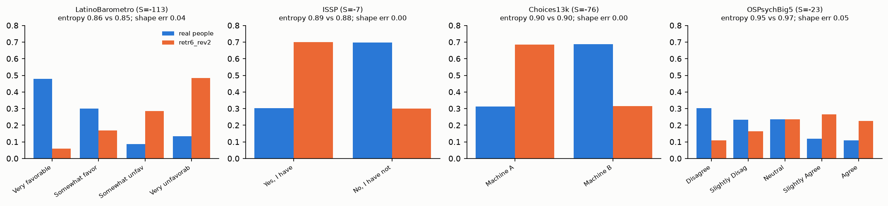
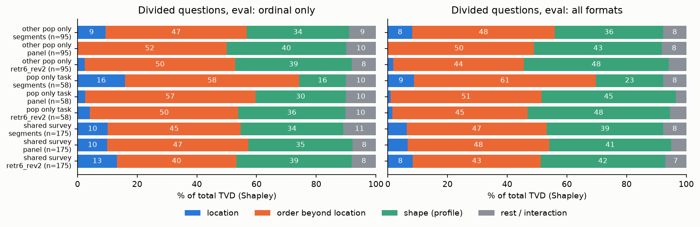
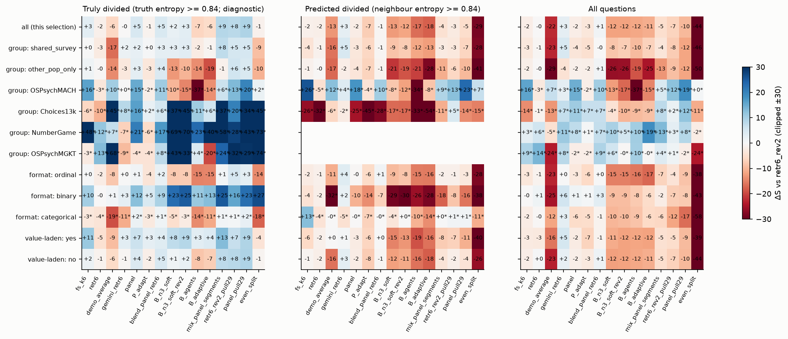

# SimBench divided questions: what exactly is wrong with the mass, and which lever fixes which part? — results

Branch `claude/blissful-pascal-0ldgye`. Code: `src/human_sim/simbench_mass_levers.py` (`python -m human_sim.simbench_mass_levers`, then `... plots`). Numbers: `results/simbench_ablate/mass_levers_report.json`. Plots: `img/mass_decomposition.png`, `img/lever_slice_heatmap.png`, `img/mass_worked_examples.png`.

No new model calls except one traced segments re-run on the four Pop-only task datasets (`Bdiag_n3_soft_tasks`, 100 questions, $0.17). All counterfactual fixes and the "dominant component" slice use the truth: they are diagnostics, never used for routing. Pop-only task datasets (OSPsychMACH, Choices13k, NumberGame, OSPsychMGKT) are reported separately throughout. CIs are 95% bootstrap over questions. A `*` means N < 30.

Divided = normalized entropy of the real answers ≥ 0.84. Eval: 328 divided of 981 questions. Dev: 127 of 380. Baseline arm = Haiku `retr6_rev2`.

---

## 0. Plain-language definitions, with real examples

Each SimBench question has a real answer distribution: the share of people choosing each option. We predict one. The error (TVD) is the share of people we place on the wrong option.

On divided questions the model usually gets **how spread out** the answers are right. Half of the divided questions (51% eval, 62% dev) have a predicted entropy within 0.05 of the truth. It gets **where the people sit** wrong. Four of the clearest cases (eval, baseline):

| Question (dataset) | Real people | Prediction | Same spread? | S |
|---|---|---|---|---|
| Opinion of Venezuela: very favorable … very unfavorable (LatinoBarometro) | 48 / 30 / 9 / 13% | 6 / 17 / 29 / 49% | yes (entropy 0.86 vs 0.85) | −113 |
| Signed an environmental petition in the last 5 years? (ISSP) | Yes 30 / No 70% | Yes 70 / No 30% | yes (0.89 vs 0.88) | −7 |
| Machine A: $19 for sure vs Machine B: $20 or $18 at 50/50 (Choices13k) | A 31 / B 69% | A 69 / B 31% | yes (0.90 vs 0.90) | −76 |
| "I talk to a lot of different people at parties" (OSPsychBig5) | leans Disagree | leans Agree | yes (0.95 vs 0.97) | −23 |

In each one the prediction has the right *shape*: sorted from largest to smallest, the two bar sets are almost identical (shape error ≤ 0.05). But it is mirrored, so the mass is on the wrong side.

The words used below:

- **Location**: on an ordered scale, where the centre of the answers sits (the mean position). *Location error* = the prediction's centre is shifted.
- **Order beyond location** (the "assignment" fix): we keep the predicted bar heights but put them on the options in the true ranking. If that fixes things, the problem was *which option gets which share*, not the shares themselves. A mirror image (Venezuela) is order, not location: no shift along the scale can turn a left-heavy distribution into a right-heavy one without changing its shape.
- **Shape** (the "profile" fix): we keep the predicted ranking of options but use the true bar heights. If that fixes things, the problem was the shares (too peaked, too flat, wrong second option), not the ranking.
- **Peaks**: the real answers have two humps (e.g. strongly agree and strongly disagree) and the prediction has one, or the reverse.
- **Interaction / rest**: what is left after averaging the three fixes in every order (Shapley). It is the part that only goes away when the fixes are combined.

## 1.2 Headline

> **On divided shared-survey questions (ordinal, eval, N 101), 13% of the error is location [10, 16], 40% is order beyond location [35, 45], 39% is shape [33, 45], and the rest (8%) is interaction.**

All formats (N 175): 8% location, 43% order, 42% shape, 7% rest. Dev replicates it (ordinal N 38): 14% / 46% / 31% / 8%.

**Location is the smallest part everywhere** (≤ 16% in every group and arm). It is the dominant component of only 3 of the 328 divided eval questions. Fixed alone, location removes 29% of the ordinal shared-survey error, but most of that overlaps with the order fix. The error splits roughly evenly between *which option gets the mass* and *how much mass each option gets*.

## One-screen summary: best lever per slice

ΔS = change vs `retr6_rev2`, eval. **Truly divided** means selected by the truth's entropy: a diagnostic selection that favours flat predictions (see §3). The last column re-tests the lever on **all questions** in the same slice. A lever that only wins on truly divided questions is mostly flattening, not information.

| Slice (eval) | Base S | Best lever on truly divided: ΔS [CI] (N) | Plain even split, same questions | Same lever on all questions | Most robust lever (all questions) | Component it fixes |
|---|---|---|---|---|---|---|
| All divided | 35.4 | panel pulled 29% to even: +9.2 [+6.0, +12.5] (328) | −1.3 | **−9.7** [−11.7, −7.7] (981) | Gemini `retr6` +2.7 [+0.3, +5.0] | shape (peakedness) |
| Shared surveys | 43.0 | panel+segments mix: +7.7 [+3.1, +11.9] (175) | −9.0 | −3.5 [−5.6, −1.5] (625) | Gemini `retr6` +4.9 [+2.5, +7.1]; dev: Sonnet 5.5 `retr6` +14.3 [+11, +18] (250) | order (Spearman +0.2, flips −27 pts with Sonnet) |
| OSPsychMACH | 2.4 | panel pulled: +19.8 [+3.3, +34.0] (24)* | +2.0 | **+18.7** [+3.8, +32.5] (25)* | panel (pulled) | order (two-peak scales) |
| Choices13k | 8.6 | segments: +45.4 [+18.1, +74.1] (15)* | **+44.9** | **−9.9** [−49, +27] (25)* | panel (pulled) +11.7 [−13, +37]* | none: flattening |
| NumberGame | −10.0 | even split +73.4 (13)*; segments +69.8* | +73.4 | segments +5.4 [−28, +38] (25)* | B_adaptive +18.6 [−4, +42]* | none: flattening |
| OSPsychMGKT | −20.2 | even split +74.5 (6)* | +74.5 | demo average −23.8* | `retr6` +13.8 [+5.5, +24.3]* | – |
| Other Pop-only | 43.7 | `retr6_rev2` pulled: +6.0 [+3.4, +8.8] (95) | −10.3 | −8.9 [−11.3, −6.7] (256) | panel/`retr6` blend +1.1 [−1.7, +4.1] | shape |
| Ordinal | 36.4 | `retr6_rev2` pulled: +5.1 [+3.1, +6.9] (197) | −14.1 | −4.1 | Gemini `retr6` +0.2 | shape |
| Binary | 30.0 | **even split +26.6** [+16.5, +36.6] (105) | +26.6 | segments −11.4 (210) | Gemini `retr6` +5.7 [+1.2, +9.8] | flattening |
| Categorical | 49.3 | panel pulled: +2.5 [−6, +11] (26)* | −17.6 | −16.8 | Gemini `retr6` +2.9 | – |
| Value-laden | 36.6 | panel+segments mix: +12.9 [+4.4, +22.4] (50) | −4.1 | −4.6 | Gemini `retr6` +5.2 | order |

**Answer in one paragraph:** the mass error on divided questions is about half "wrong option ranking" and half "wrong shares", with location a minor part. No prompt lever we have fixes the ranking. Only a different or bigger model does: Gemini `retr6` on eval, and Sonnet 4.6 / 5.5 `retr6` on dev. Those are the only levers positive on truly divided, predicted-divided *and* all questions, and they raise Spearman and cut flips. Every "spread" lever (segments, the pull toward an even split, mixes) wins on truly divided questions mainly because the selection rewards flatness: a plain 50/50 guess beats them on the task datasets. Applied to the questions a router would actually send them (predicted-divided), they lose. OSPsychMACH is the one place where a harness lever (the panel) survives all three views.

---

## 1. Part 1: mass anatomy

### 1.1 Component metrics (eval, divided, by group × format)

| Group / format | Arm | N | S | Entropy gap | Shape err | Spearman | Top-1 right | Top-2 right | \|Location shift\| | Flip | Peak mismatch (TVD share) |
|---|---|---|---|---|---|---|---|---|---|---|---|
| Shared / ordinal | `retr6_rev2` | 101 | 38.2 | −0.005 | 0.119 | 0.61 | 0.48 | 0.43 | 0.098 | 0.16 | 9 q (10%) |
| | panel | 101 | 38.2 | +0.020 | 0.117 | 0.50 | 0.44 | 0.34 | 0.091 | 0.24 | 15 q (16%) |
| | segments rev2 | 101 | 42.2 | +0.043 | 0.114 | 0.59 | 0.46 | 0.38 | 0.085 | 0.24 | 17 q (17%) |
| Shared / binary | `retr6_rev2` | 51 | 50.2 | −0.021 | 0.091 | 0.46 | 0.67 | – | – | – | – |
| | panel | 51 | 58.3 | +0.015 | 0.082 | 0.36 | 0.65 | – | – | – | – |
| | segments rev2 | 51 | 55.7 | +0.063 | 0.108 | 0.16 | 0.55 | – | – | – | – |
| Shared / categorical | `retr6_rev2` | 23* | 48.3 | +0.025 | 0.111 | 0.57 | 0.52 | 0.48 | – | – | – |
| Pop-only tasks / ordinal | `retr6_rev2` | 24* | 2.4 | −0.011 | 0.116 | 0.31 | 0.54 | 0.38 | 0.145 | 0.33 | 9 q (47%) |
| | panel | 24* | 17.5 | +0.014 | 0.096 | 0.42 | 0.46 | 0.29 | 0.116 | 0.33 | 11 q (42%) |
| | segments rev2 | 24* | −12.4 | +0.041 | 0.116 | −0.15 | 0.21 | 0.08 | 0.134 | 0.62 | 9 q (42%) |
| Pop-only tasks / binary | `retr6_rev2` | 34 | −3.6 | −0.154 | 0.153 | – | 0.47 | – | – | – | – |
| | panel | 34 | 10.8 | −0.130 | 0.132 | – | 0.47 | – | – | – | – |
| | segments rev2 | 34 | 49.0 | 0.000 | 0.081 | – | 0.44 | – | – | – | – |
| Other Pop-only / ordinal | `retr6_rev2` | 72 | 45.4 | 0.000 | 0.087 | 0.58 | 0.61 | 0.40 | 0.078 | 0.16 | 22 q (30%) |
| | panel | 72 | 43.0 | +0.013 | 0.100 | 0.58 | 0.61 | 0.39 | 0.074 | 0.16 | 20 q (26%) |
| | segments rev2 | 72 | 23.7 | +0.011 | 0.144 | 0.46 | 0.19 | 0.25 | 0.098 | 0.14 | 19 q (31%) |
| Other Pop-only / binary | `retr6_rev2` | 20* | 35.6 | −0.107 | 0.120 | – | 0.65 | – | – | – | – |

(Entropy gap = predicted − true normalized entropy. Shape error = TVD between sorted profiles. Spearman on binary is ±1 and is omitted. Flip = the predicted modal side of the scale is opposite to the true one.)

What the components say:

- **Spread is right** on shared surveys and ordinal scales: the mean entropy gap is within ±0.04, and the SD gap on ordinal is within ±0.02. Only the binary Pop-only rows are too peaked (−0.15 for the baseline); segments fix exactly that (gap 0.00).
- **Shape error is still about 0.09–0.15** although the entropy matches. Same entropy does not mean same profile: e.g. 50/30/20 and 45/45/10 have similar entropy.
- **Ranking is weak.** Spearman is 0.3–0.6 and top-1 is right on only 48% of divided shared ordinal questions. On 16% the prediction sits on the wrong side of the scale (flip).
- **Location shift is small and unbiased on average** (signed +0.01 on shared ordinal) but not per question (|shift| ≈ 0.10 of the scale). The error is not a systematic lean.
- **Two-peak truth predicted as one peak** is concentrated in the Pop-only rows: 29% of task-ordinal and 24% of other-Pop ordinal questions, vs 7% of shared ordinal. On task ordinal it accounts for 47% of the TVD. The prediction rarely invents a second peak (2–8%).
- **EMD vs TVD:** EMD/TVD ≈ 0.52–0.69. Much of the misplaced mass sits several scale steps away, not on a neighbouring option. That is consistent with order errors, not small shifts.
- **"Don't know" / middle option:** the middle option is within 3 pts on ordinal surveys. DK mass on shared binary questions is +25 pts too high, but only on N 4 such questions. Elsewhere DK is within ±5 pts (it is under-predicted on other-Pop ordinal, −5 pts).

### 1.2 Decomposition (Shapley over location / order / shape fixes)

Shares of total TVD, eval, divided questions:

| Group | Format | Arm | N | Location | Order | Shape | Rest | Peak-mismatch questions' TVD share | S after each fix alone (loc / order / shape) |
|---|---|---|---|---|---|---|---|---|---|
| Shared | ordinal | `retr6_rev2` | 101 | **13%** [10, 16] | **40%** [35, 45] | **39%** [33, 45] | 8% | 10% | 57.6 / 62.8 / 56.4 (from 38.2) |
| Shared | all | `retr6_rev2` | 175 | 8% [6, 11] | 43% [38, 48] | 42% [36, 48] | 7% | 6% | 54.2 / 64.8 / 60.7 (from 43.0) |
| Shared | all | panel | 175 | 7% | 47% | 41% | 5% | 10% | |
| Shared | all | segments rev2 | 175 | 6% | 47% | 39% | 8% | 11% | |
| Pop-only tasks | all | `retr6_rev2` | 58 | 1% [−1, 4] | 45% [36, 54] | 48% [39, 57] | 5% | 17% | 4.8 / 39.5 / 43.0 (from −1.1) |
| Pop-only tasks | all | segments rev2 | 58 | 9% | 61% | 23% | 8% | 23% | |
| Other Pop-only | all | `retr6_rev2` | 95 | 2% [−3, 6] | 44% [36, 51] | 48% [41, 56] | 6% | 22% | 49.4 / 65.1 / 66.2 (from 43.7) |
| Dev: shared | ordinal | `retr6_rev2` | 38 | 14% [10, 19] | 46% [39, 53] | 31% [24, 39] | 8% | 14% | 47.8 / 58.9 / 37.0 (from 21.4) |

The Shapley shares add to 100% together with "rest". For questions with no ordered scale (binary, categorical), the location fix does nothing, so location is 0 there by construction.

Dominant component per question (eval, baseline, 328 divided): shape 175, order 109, peaks 40, **location 4**.

### 1.3 Interpretation table

| If the dominant part is… | It means | The lever that should fix it | What we observe |
|---|---|---|---|
| Location | the whole crowd is shifted along the scale | a centre anchor (real data on this question, a calibrated mean) | almost never dominant (4 / 328) |
| Order | right bar heights, wrong options | information that ranks options for *this* question: better world knowledge, a same-question anchor | only bigger or different models move it (Sonnet on dev: Spearman +0.2, flips −27 pts on shared surveys) |
| Shape | right ranking, wrong heights (too peaked/flat, wrong runner-up) | spread levers: segments, panel, pull toward an even split | they do move it (shape error −0.04 to −0.05 on task datasets), but often overshoot toward flat |
| Peaks | truth has two humps, prediction one | personas that hold opposing views | panel and pulled panel help (+9.3 [+2, +17] on peak-dominant questions); segments hurt (−14.6) |

### 1.4 The 10 worst questions per group (eval, baseline)

**Shared surveys** (dominant: order 7, shape 2, peaks 1):

| S | Dominant | Dataset | Question | Truth | Prediction |
|---|---|---|---|---|---|
| −113 | order | LatinoBarometro | Opinion of Venezuela (very fav … very unfav) | .48 .30 .09 .13 | .06 .17 .29 .49 |
| −108 | order | LatinoBarometro | same question, another country | .50 .29 .10 .12 | .07 .19 .35 .40 |
| −103 | order | LatinoBarometro | "When jobs are scarce, men should have more right to a job" | .11 .35 .44 .10 | .13 .11 .16 .61 |
| −67 | shape | ESS | "Would feel ashamed if a close family member were gay" | .05 .19 .24 .31 .21 | .02 .03 .05 .17 .74 |
| −61 | peaks | LatinoBarometro | ID documents should recognise a sex change | .40 .17 .11 .31 | .12 .35 .35 .19 |
| −53 | order | LatinoBarometro | Support a military government if things get difficult? | .67 .33 | .28 .72 |
| −48 | order | ESS | Gay and lesbian couples should have equal adoption rights | .06 .16 .21 .25 .32 | .34 .35 .13 .11 .08 |
| −46 | order | LatinoBarometro | Satisfied with your life? | .43 .30 .24 .03 | .08 .27 .38 .27 |
| −43 | order | LatinoBarometro | Is this country progressing / standing still / declining | .27 .54 .19 | .16 .28 .56 |
| −43 | shape | ESS | gay family member (another cell) | .05 .15 .22 .29 .29 | .02 .03 .05 .17 .74 |

The worst shared-survey errors are mirrored answers on value-laden or country-specific questions: the model gives the "expected" answer for a liberal or pessimistic respondent, and the real group answers the other way.

**Pop-only task datasets:**

- **OSPsychMACH** (order 4, peaks 5, shape 1): "people have a vicious streak" (S −148, truth leans agree, prediction strongly disagree). "Honesty is the best policy in all cases" ×3: truth is two-peaked (34% disagree, 18% agree), prediction is one peak at agree (45%). "There is no excuse for lying."
- **Choices13k** (order 5, shape 5 among the 10 lowest): equal-EV gambles where the prediction picks the safe machine at 69–80% and people go the other way. E.g. $19 sure vs $20/$18: 31% safe.
- **NumberGame** (order 6, shape 4): the prediction says "No, not likely next" at 75–88%. Real people say "Yes" at 55–71% (e.g. 92, 14, 20, 5 → 72? truth Yes 71%).
- **OSPsychMGKT** (6 divided only): "Is Caliper a craftsman's tool?" The prediction says Yes at 89%, while 66% of people said No. Same for Trichomoniasis / STD and Bevel.

**Other Pop-only** (order 6, shape 4): MoralMachine swerve dilemmas (mirrored 69/31), ConspiracyCorr items, OSPsychBig5 extraversion items, MoralMachineClassic.

---

## 2. Part 2: lever map

### 2.1 Levers

| Lever (spec name) | Arm(s) in logs | Calls? |
|---|---|---|
| Real demos at all | `base` (no demos) vs `retr6` | logged |
| Demo selection | `fs_k6` (random 6), `retr6` (similar 6), `retr6_rev2`; dev `retr6_vs3` | logged |
| Demo average used as prediction | `demo_average`: plain mean of option-aligned retrieved demos (exists for 573 / 981 eval questions) | none |
| Option-order averaging | `retr6_rev2`, `B_n3_soft_rev2`; dev `panel_both_orders` | logged / derived |
| Persona panel | `panel` (P_groundall5), `P_adapt`; dev `panel_R` | logged |
| Segments | `B_n3_soft`, `B_n3_soft_rev2`, `B_agents`, `B_adaptive`; dev `B_ground3(_rev2)` | logged |
| Multi-candidate / mixes | `mix_panel_segments` (0.4 panel + 0.6 segments), `blend_panel_retr6` (§4.10 dev-fitted), dev `best_mix_no_pull` | derived |
| Pull toward an even split | `retr6_rev2_pull29`, `panel_pull29`, dev `best_mix_pull29`; and the plain `even_split` as a reference | derived |
| Model | eval `gemini_retr6`; dev `sonnet46_retr6`, `sonnet55_retr6`, `gemini_retr6` | logged |

### 2.2 Lever × slice (ΔS vs `retr6_rev2`)

The heatmap shows three selections side by side, eval:

1. **truly divided** (truth entropy ≥ 0.84; diagnostic);
2. **predicted divided** (neighbour entropy ≥ 0.84: the mean entropy of the retrieved demos; truth-free; catches 151 of the 328 divided, plus 107 non-divided);
3. **all questions**.

Full tables, with CI and N for every cell and both eval and dev, are in `mass_levers_report.json` under `lever_matrix`, `lever_matrix_truthfree` and `lever_matrix_allq`.

Selected rows (eval; ΔS [CI], N):

| Slice | panel | segments rev2 | panel+segments mix | `retr6_rev2` pulled | panel pulled | Gemini `retr6` | even split |
|---|---|---|---|---|---|---|---|
| Truly divided, all (328) | +4.7 [+1, +8] | +3.2 [−1, +8] | **+8.7** [+5, +12] | +8.1 [+6, +10] | **+9.2** [+6, +12] | +0.0 | −1.3 |
| Predicted divided, all (258) | −2 | −12 | −4 | −3 | −5 | **+2.6** [−2, +7] | −28.5 |
| All questions (981) | −1.9 [−4, −0] | −12.0 | −5 | −7 | −9.7 | **+2.7** [+0, +5] | −43.6 |
| Truly divided shared (175) | +2 | +3.4 | **+7.7** [+3, +12] | +5.3 | +5.0 | +2 | −9.0 |
| Predicted divided shared (151) | −3 | −8 | −3 | −3 | −7 | **+4.9** [+0, +10] | −28.0 |
| Truly divided ISSP (46) | +3 | +8.8 [+3, +15] | +10.2 [+5, +16] | +2.6 | +2.3 | +3.9 | −9.5 |
| Truly divided OSPsychMACH (24*) | +15.1 [+1, +28] | −14.8 | +6 | +13.3 | **+19.8** [+3, +34] | +0 | +2.0 |
| Truly divided binary (105) | +12 | +25.0 [+16, +34] | +25.1 | +15.6 | +22.6 | +3 | **+26.6** [+16, +37] |
| Predicted divided binary (49) | −10 | −30 | −18 | −8 | −16 | +2.2 | −37.8 |

Dev (shared surveys) confirms the model lever. Sonnet 5.5 `retr6`: truly divided +11.2 [+2, +20] (69), predicted divided +15.0 [+6, +24] (43), all questions +14.3 [+11, +18] (250). Sonnet 4.6 is similar. Dev's best harness on truly divided (`best_mix_pull29`, +14.2 [+8, +21], 126) drops to −5.9 [−12.8, +0.5] on predicted-divided questions (81).

Reading the matrix:

- **Model is the only lever that holds up in all three selections**, and it is the only one that moves *order* (§2.3).
- **Spread levers depend on the selection.** On truly divided questions, flatter is almost always better (the truth is near even by construction, especially on binary questions: entropy ≥ 0.84 means 28–72%). On predicted-divided questions, half of which are not divided, the flattening costs more than it gains.
- **On binary divided questions a plain 50/50 guess (+26.6) beats every harness**, including segments (+25.0).
- **Demo average as the prediction** loses on shared surveys (−16.7 truly divided, −22.9 all questions). The model's reading of the demos is better than their raw mean, except on Choices13k / MGKT truly divided (N 15 / 6). Those cases do not survive on all questions.
- **Option-order averaging** helps the panel on dev (truly divided: `panel_both_orders` +8.9 vs panel +2.8 overall; +1.7 on shared, +5 on other Pop-only, +17 on OSPsychMACH*, +49 on Choices13k*). For `retr6` it is small (`retr6_rev2` vs `retr6`: `retr6` −2 on truly divided, −0 on all).
- **Value-laden questions** (N 50): the mix is best (+12.9 [+4, +22]), but it falls to −4.6 on all value-laden questions. Gemini +5.2 holds.
- **Dominant component (diagnostic):** questions dominated by order are where every lever gains most (base S 11.5). That is because they are the worst questions, and flattening helps most there (even split +15.2). Peak-dominated questions are helped by the panel (+9.3 [+2, +17]) and hurt by segments (−14.6).

### 2.3 Lever × components (what each lever actually changes; mean change vs `retr6_rev2`, divided)

| Group | Lever | \|Location\| | Spearman | Top-1 right | Shape err | \|Entropy gap\| | Flip |
|---|---|---|---|---|---|---|---|
| Shared (eval, 175) | panel | −0.007 | −0.05 | −0.02 | −0.004 | −0.009 | +0.07 |
| | segments rev2 | −0.013 | −0.09 | −0.06 | +0.003 | −0.007 | +0.08 |
| | mix | −0.023 | −0.01 | −0.02 | −0.004 | −0.011 | +0.07 |
| | Gemini `retr6` | −0.004 | **+0.06** | **+0.06** | −0.003 | +0.002 | +0.06 |
| Shared (dev, 69) | Sonnet 5.5 `retr6` | **−0.053** | **+0.22** | **+0.19** | −0.008 | −0.011 | **−0.27** |
| | Sonnet 4.6 `retr6` | −0.054 | +0.18 | +0.17 | −0.011 | −0.013 | −0.27 |
| | best mix (pull 29%) | −0.031 | +0.01 | +0.07 | −0.003 | −0.009 | −0.03 |
| Pop-only tasks (eval, 58) | panel | −0.029 | +0.09 | −0.03 | −0.020 | −0.019 | 0.00 |
| | segments rev2 | −0.011 | **−0.28** | **−0.16** | −0.042 | **−0.071** | +0.08 |
| | mix | −0.030 | −0.01 | −0.02 | −0.049 | −0.068 | +0.04 |
| | demo average | −0.030 | +0.07 | −0.05 | −0.034 | −0.050 | +0.08 |
| Other Pop-only (eval, 95) | segments rev2 | +0.020 | −0.13 | **−0.37** | +0.033 | −0.001 | 0.00 |
| | panel | −0.004 | +0.00 | −0.01 | −0.003 | −0.012 | −0.02 |

The spread levers (segments, mix) cut the shape and entropy error but *worsen* ranking: Spearman falls and top-1 falls. They fix "how much" by making everything flatter and lose "which". Only the bigger models improve ranking and cut flips. That matches the decomposition: order is ~45% of the error, and no prompt lever touches it.

### 2.4 Mechanism on the four task datasets (panel traces + traced segments re-run)

Truly divided eval questions, Haiku. "Diversity" = mean pairwise TVD between the sub-answers (panel types or segments).

| | OSPsychMACH (24) | Choices13k (15) | NumberGame (13) | OSPsychMGKT (6) |
|---|---|---|---|---|
| Panel type diversity | 0.31 | **0.17** | **0.19** | 0.35 |
| Segment diversity | 0.45 | 0.46 | 0.36 | 0.37 |
| Panel S, model's shares | **17.5** | 24.9 | 10.8 | −24.4 |
| Panel S, equal weights | 5.5 | **34.3** | **20.9** | **47.2** |
| Largest type's share | 32% | 46% | 45% | 74% |
| Truth mass on expert option | – | 0.52 | – | 0.54 |
| Panel types' mean mass on expert | – | 0.51 | – | 0.64 |
| Panel final mass on expert | – | 0.54 | – | 0.76 |
| Segments' mass on expert | – | 0.55 | – | 0.59 |
| `retr6_rev2` mass on expert | – | 0.58 | – | 0.76 |
| Real humans in the retrieved demos, mass on expert | – | 0.64 | – | 0.88 |

(Expert option: Choices13k = the higher expected-value machine, from the gamble text, N 14. OSPsychMGKT = the dataset's `answer_value`. **Caveat:** that key looks unreliable: "Fedora is a Linux version" and "Trichomoniasis is an STD" are keyed No. So the MGKT expert rows are shown but not relied on. NumberGame and OSPsychMACH have no expert option.)

Which hypothesis the data supports:

1. **The panel types collapse to one answer (supported on Choices13k and NumberGame).** Types get different descriptions but near-identical answers: pairwise TVD 0.17–0.19, vs 0.36–0.46 for segments. In the worst Choices13k case all five types ("risk-averse", "EV optimisers", "variance-conscious", "random responders") answer A 72%, while people chose B 69%. In the worst NumberGame cases every type says "No" at 72–88%.
2. **The planner's weights hurt (supported on 3 of 4).** Equal weights beat the model's shares on Choices13k (+9.4), NumberGame (+10.1) and MGKT (+71.6, N 6). The planner gives the largest share to the most "rational" type (45–74%). On OSPsychMACH the shares help (+12.0).
3. **The sub-answers are pulled to the expert option (not supported on Choices13k).** The panel's types put 0.51 on the higher-EV machine vs 0.52 for real people. The retrieved demos lean further to the expert option (0.64) than the targets do. That is because divided targets are by definition near 50/50 while random demos are not, which is itself a selection effect.
4. **Segments win on these datasets because they are flatter, not better informed.** On truly divided task questions segments ≈ a plain even split (Choices13k +45.4 vs +44.9; NumberGame +69.8 vs +73.4). Across *all* questions of these datasets segments lose on Choices13k (−9.9) and gain little on NumberGame (+5.4, CI −28 to +38). Over all questions the even split scores 0 by construction.

Five worst panel questions per dataset, with every type's description, share and answer, are in `mass_levers_report.json → mechanism_eval → <dataset> → worst5_panel`.

### 2.5 Simple routing rule (fit on dev, applied to eval)

Rule: for each (dataset, format, value-laden) cell with ≥ 8 dev questions, use the arm with the best dev S, falling back to (dataset, format), then dataset, then (format, number of options), then the best single arm. Arms: the 9 logged Haiku harnesses plus the two pulled variants. Truth-free at prediction time (dataset, format and option text only).

| Eval set | N | Always `retr6_rev2` | Best single dev arm (= `retr6_rev2`) | Neighbour-agreement router (P_adapt / panel) | Dev-fitted rule | Rule − `retr6_rev2` [CI] |
|---|---|---|---|---|---|---|
| All | 978 | **43.5** | 43.5 | 41.8 | 42.1 | −1.3 [−3.3, +0.8] |
| Divided | 328 | 35.4 | 35.4 | **39.7** | 37.6 | +2.2 [−1.1, +5.6] |
| Divided shared | 175 | 43.0 | 43.0 | **45.3** | 44.1 | +1.1 [−2.1, +4.3] |
| Divided Pop-only tasks | 58 | −1.2 | −1.2 | 11.4 | **15.6** | +16.8 [+6.1, +28.6] |
| All Pop-only tasks | 100 | 9.2 | 9.2 | **15.8** | 11.5 | +2.3 [−8.9, +13.4] |

Neither router beats always-`retr6_rev2` over all questions. The dev-fitted rule picks segments for Choices13k, which wins on the divided subset (+16.8) but not over all task questions (+2.3, CI includes 0). Same lesson as §2.2: dev cells of 10 questions are too small to learn a per-dataset harness reliably.

### 2.6 Untested levers (no results; labelled for planning)

- **Fitted type weights** (learn per-type weights on dev rather than asking the planner for shares). Motivated by §2.4: equal weights beat model shares on 3 of 4 task datasets.
- **Forced-diverse panel types**: each type must commit to a different option, or types are defined by their answer rather than their description. Targets the collapse in §2.4.
- **Two-peak personas for scales with opposing camps** (MACH honesty items, LatinoBarometro rights items). Targets the peaks component.
- **Larger model inside the panel** (Sonnet 5.5 as the type generator). The model lever is the only one that fixes order; untested whether it carries through the panel.
- **Cyclic option orders** (more than two orders) for the panel.
- **Task-specific prompts**: EV and risk framing for Choices13k; "how do people judge number sequences" for NumberGame.
- **Same-question anchors** from other waves or countries: +30.7 as a diagnostic in §4.12, but no legitimate source has been wired in.
- **Opus** (available on Vertex; not run).

---

## 3. Strongest counter-reading

*"The decomposition and the lever map are partly artifacts of selecting questions by the truth."*

- **Lever map.** Selecting divided questions by the true entropy guarantees that the truth is near even. Any lever that flattens will look good there, and a plain 50/50 guess does (+26.6 on binary divided). That is why segments look strong on task datasets in the earlier rounds (§4.11, §4.13: "+25.4"). Re-tested on questions picked without the truth (neighbour entropy) or on all questions, those gains vanish or reverse. This counter-reading is **right**: we rewrite the lever conclusions accordingly.
- **Decomposition.** The decomposition is per question and does not suffer from the selection in the same way. But "order vs shape" depends on how the fixes are defined. A mirrored ordinal answer counts as *order*, because translation cannot mirror. Someone might call that a "location" error ("the crowd is on the wrong side"). Counting all flips as location would move location from 13% to roughly 13% + the flip-driven part of order. With flips on 16% of shared ordinal questions, that could plausibly put location at about a quarter. This is an estimate: the decomposition was not re-run with flips counted as location. Either way, the claim that *spread is not the problem* still holds: the entropy gap is ≈ 0 and order + shape dominate.
- **The pull toward an even split** in our current best divided pick (§4.10) is partly this same selection effect. It was tuned on truly divided dev questions. It helps there (+8 to +10) and hurts over all questions (−7 to −10). It is only safe behind a router that is right about which questions are divided, and our routers are not (§2.5).

## 4. What changes in the plan

1. **Stop tuning spread** on truth-selected divided questions. Evaluate divided-question levers on predicted-divided or all questions.
2. **The error to attack is order** (≈ 45%): which option the crowd favours. The only lever that moves it is the model (Sonnet 5.5 `retr6`: +14.3 on all dev shared-survey questions, +15.0 on predicted-divided). Run the panel with Sonnet 5.5 as a next step.
3. **For the panel**, fix type collapse and the planner's weights (forced-diverse types, equal or fitted weights) before adding more machinery.
4. **Pop-only task datasets** stay unsolved. The apparent segments win is flattening; only OSPsychMACH has a real panel gain (+18.7 on all its questions, N 25).
